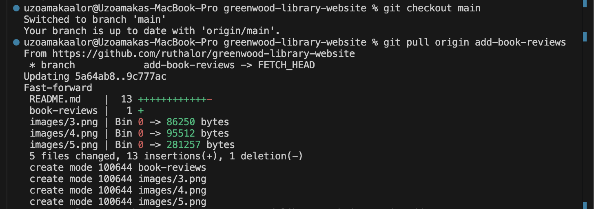
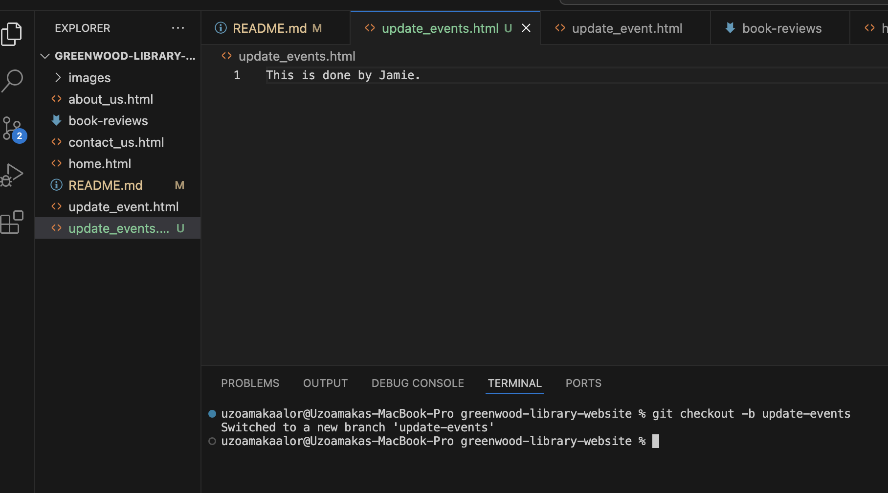

# Greenwood Library Website
In our main branch, we are creating different files, this is to be staged, commited and pushed to the main branch. 

Next, we are to stage, commit and push these changes to the main branch. 

Next we are to create and switch to a new branch for Morgan.  Name the branch **add-book-reviews**

Next, create a new file. Our new file is **book_reviews**

 

Stage, commit and push these changes to the **add-book-reviews** branch.

Here we have the changes made on the **add-book-reviews** branch pulled into the main branch, also this has been committed and pushed to the main branch repository. 

Next, create a new branch for Jamie. Name of branch is **update-events**
Also create a new file for Jamie

Stage, Commit and Push these changes to the **update-events** branch on Github. 
